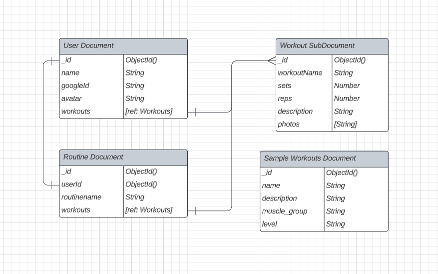

# Fit Trackr

Welcome to Fit Trackr! Fit Trakr is a fitness website where you can create and personalize workouts and routines

## Introduction

Welcome to Fit Trackr, where you are the architect of your fitness journey. Our platform empowers fitness enthusiasts like you to craft personalized workouts and routines that are as unique as your goals. No more cookie-cutter fitness plans - take control and let your creativity thrive!

## Screenshots

## ERD

## Technologies Used
- Node.js
- Express.js
- HTML
- CSS
- MongoDB

## Get Started
- Link to Fit Tracker - [Fit Trackr](https://fit-trackrrr-95a1df865206.herokuapp.com/)
- Link to Trello - [Trello](https://trello.com/b/FPntCcnJ/project-2-building-a-crud-app)

## Ice Features
- Filter personal workouts
- Add a Calorie tracker
- Add a calender to track progress
- JS animations
